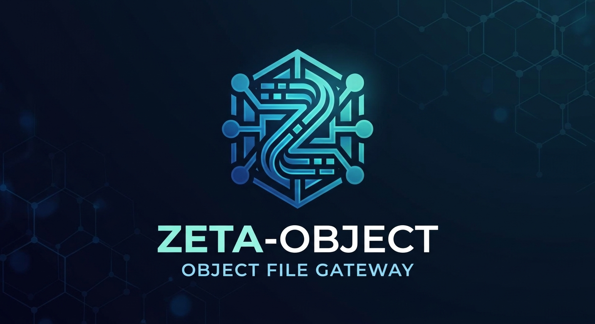
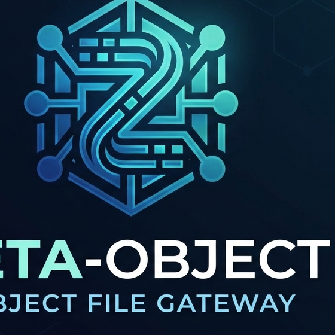

<p align="center">
  
</p>

<p align="center">
  
  <br>
  <sub>Square icon variant (<code>logo-icon.png</code>) for avatars and other external use. Nothing in the repo serves a favicon.</sub>
</p>

# zeta-object

Zeta-Object is an object gateway to your files - an unobtrusive server which provides access to your existing filesystem while maintaining common object semantics and capability.

**Feature differentiation:**

- Near-parity compatibility with [AWS S3](docs/protocol-compatibility.md), WebDAV, and ownCloud
- Native object access to traditional filesystems
- Metadata using the OpenZFS `events` feature: full auditability, and metadata travels with the files and the dataset
- No auxiliary databases. Metadata on non-ZFS filesystems resides in a `.metadata` directory
- Single-server design: no need for additional services
- Native Linux and macOS "file sync" capabilities similar to Dropbox using the zeta-sync client, allowing for Unix-like context

---

**A single-binary S3 server with filesystem superpowers.**

zeta-object speaks the S3 protocol and stores your data where you can see it: plain files, in your directories, on your filesystems. Where every other object server buries your data in its own opaque store, zeta-object treats your filesystem as the source of truth - and adds capabilities no cloud S3 can offer, because only a filesystem co-located with your data can offer them.

- **Small static binaries.** The gateway is one static binary; an optional second binary serves the web console. No database, no etcd, no external services. `make build`, run it, done.
- **Zero-format storage.** Objects are plain files; metadata is a JSON sidecar. Your data is readable with `cat` and `ls` with the server stopped. Point a bucket at `/var/log`, a ZFS dataset, an NFS mount, or a directory of symlinks and it is an S3 bucket *now*.
- **Standard, verified wire compatibility.** AWS CLI, boto3, and mc work against it - proven by an interop e2e suite and a ceph/s3-tests ratchet, not by marketing.
- **Protocol-flexible by design.** A pluggable frontend/backend architecture (S3, WebDAV, FTP/FTPS, SFTP, ownCloud, and HTTP/3 all shipped) over a neutral object model - one implementation per protocol and per storage, not one per combination.
- **Extensible metadata.** A probe-based MetadataProvider seam attaches enrichment capabilities to buckets when - and only when - the underlying filesystem supports them. The first provider reads ZFS per-dataset file-event logs, giving per-object history and version-style listings that hosted S3 cannot give you.

## The pitch: what proves zeta-object different

Most "S3-compatible" servers are the same idea restated: a service that owns a black-box store and translates S3 verbs against it. zeta-object takes the opposite bet, and these five properties follow from it:

1. **Your data is never held hostage.** Every object is a file you own, at a path you chose. Back up with rsync, replicate with ZFS send, grep it, migrate away by copying a directory. There is no export step because there is nothing to export.
2. **Existing directories become S3 buckets with zero migration.** Bucket `logs` at `/var/log` means the decade of log files already on disk is immediately listable, downloadable, and presign-able over S3 - byte-for-byte, no import, no copy. Symlinks are followed, so a bucket can live anywhere.
3. **Filesystem capabilities become S3 capabilities.** When a bucket sits on a ZFS dataset polled by the zmetad daemon (per-dataset file-op history exported to SQLite), zeta-object serves `GET /<bucket>?events` and `GET /<bucket>?versions` derived from the kernel's own record of what happened to each file - create, rename, truncate, delete - with loss indicators. No hosted S3 offers object history; no opaque object server can borrow it from the filesystem. When the filesystem does not support it, the capability is simply absent (a clean 503), never faked. The kernel side of that log is not in stock OpenZFS: it ships on the `extended-metadata` branch of [`bhodgens/zfs-metadata`](https://github.com/bhodgens/zfs-metadata) - see [the prerequisite](#prerequisite-the-extended-metadata-branch-of-the-openzfs-fork).
4. **Pluggable on both axes, honest about semantics.** Frontends (client protocols) and backends (storage) plug into one neutral object model, and the seams reject what a protocol cannot express instead of silently emulating it. A parity gate proves an enabled metadata provider changes nothing about core S3 responses.
5. **Small enough to read, hardened enough to trust.** Two small Go binaries (the gateway plus the optional web console), a tiny audited dependency set (all licenses in docs/licenses/), and a gate wall: 1,376 unit test functions, an 881-assert e2e suite over 39 cases, race detector, fuzzing, ceph/s3-tests conformance ratchet, staticcheck/gosec, and a pre-commit chain that enforces all of it. The codebase is small enough that an afternoon of reading covers every line that touches your data.

The honest, per-operation capability matrix for every protocol — what is implemented, what degrades and how, what is absent — lives in [docs/protocol-compatibility.md](docs/protocol-compatibility.md). The per-operation **S3 behavior contract** (request/response shapes, error codes, and every deliberate divergence from AWS S3, maintained under the upstream-zfs documentation contract): [docs/s3-behavior.md](docs/s3-behavior.md).

## Who it is for

- **Homelab and self-hosting:** S3 for your existing NAS directories, ZFS pools, and backup trees - with snapshots and event history baked in.
- **Legacy storage gateways:** give an old file server or archive an S3 API without moving a byte.
- **Development and CI:** a dependency-free S3 endpoint with real SigV4, range requests, multipart, and presigned URLs - honest errors, fast startup, no containers required.
- **Backup targets:** rclone and any S3-native backup tool, pointed at directories you control and replicate on your own terms.

## Feature highlights

**S3 core** - buckets, objects, multipart (parts 1-10000, expiry sweeper), ListObjectsV2 (prefix/delimiter/continuation/`encoding-type=url`), CopyObject (COPY/REPLACE directives), object tagging (`x-amz-tagging` on PUT/COPY with COPY/REPLACE directives, the `?tagging` GET/PUT/DELETE sub-resource, `TagCount` on GET/HEAD), batch DeleteObjects, `?versions` listing, S3 versioning (`?versioning` enable/echo, versioned overwrites, delete markers, `?versionId` reads - sidecar mechanism for file-backed buckets, snapshot-derived faux versioning or opt-in sidecar/both for ZFS buckets via `zfs_versioning`), multi-span Range requests (RFC 9110 `multipart/byteranges`), conditional GET (If-Match/If-None-Match/If-(Un)Modified-Since), presigned URLs, verified `aws-chunked` streaming signatures. See [docs/protocol-compatibility.md](docs/protocol-compatibility.md) for the full matrix.

**Auth** - AWS Signature Version 4 (header and presigned), 15-minute clock-skew window, configurable verification region (default `us-east-1`).

**Event Actions** - run shell commands on upload/download/delete with glob matching, per-subdirectory merge/override/disable inheritance, inactivity triggers (e.g. `zfs snapshot` after 30 quiet minutes), safe single-quote shell-quoting of all variables, timeouts with process-group kill. See [Event Actions](#event-actions).

**Metadata capability endpoints** - when a bucket's filesystem provides an event log (ZFS `org.openzfs:events`, exported by the zmetad daemon to SQLite; needs the `extended-metadata` branch of [`bhodgens/zfs-metadata`](https://github.com/bhodgens/zfs-metadata) - see [the prerequisite](#prerequisite-the-extended-metadata-branch-of-the-openzfs-fork)): object and bucket event history as JSON, a versions-style XML listing derived from the log (delete markers included, `IsLossy`/`RecordsLost`/`RingSwaps` loss indicators - swaps and lost records are separate classes, never folded), probed lazily per bucket. Absent capability = clean 503, zero overhead.

**ZFS bucket datasets** - opt-in per-bucket ZFS provisioning: with `zfs_bucket_datasets` on, every S3-created bucket becomes its own dataset (`zfs create <dataDirDataset>/<bucket>`), so snapshots, quotas, and `.zfs/snapshot/` history are per-bucket-correct; bucket delete destroys the dataset, and a dataset with snapshots refuses deletion with `409 BucketHasSnapshots` (never a recursive destroy - the operator removes snapshots). See [ZFS bucket datasets](#zfs-bucket-datasets).

**Object tagging** - `x-amz-tagging` on PUT, the `?tagging` GET/PUT/DELETE sub-resource, `TagCount` on GET/HEAD, and tag COPY/REPLACE directives on CopyObject, with S3 validation limits (10 tags, 128-byte keys, 256-byte values, reserved `aws:` prefix → `InvalidTag`). Tags live in the per-object `.metadata/` JSON sidecar (the charter-sanctioned metadata path) for both bucket kinds today; ZFS-native tag storage lands with upstream zfs-metadata#13 behind the `tagStore` seam — until then the sidecar is the v1 store for ZFS buckets too.

**Operations** - HTTPS-only (TLS 1.2 minimum), graceful 30s shutdown drain, per-key write serialization, atomic writes (temp + fsync + rename) so a crash never truncates an object, path-traversal rejection, optional `max_put_bytes` per backend (default 5 GiB, the S3 single-PUT limit).

**HTTP/3 transport** - an optional `h3` frontend serves the WebDAV data plane over QUIC (UDP), authenticated by TLS client certificates; every HTTP frontend advertises it with Alt-Svc and clients fall back to TCP when UDP is blocked. See [HTTP/3 transport](#http3-transport).

**Management API** - a separate loopback-bound listener authenticated by a TLS client certificate (mTLS), serving a JSON surface (not S3 XML) to read server state, change configuration at runtime, persist it, inspect and manage buckets, reload identities and the client CA, and purge metadata history; dataset destruction stays a host-level operator action. See [Management API](#management-api).

**Web console** - a separate, loopback-bound binary (`zeta-object-admin`) serving a browser UI over the management surface. It holds the gateway's administrative client certificate so the browser never has to, proxies every management route one-to-one under `/api`, and keeps no state on disk. See [Web console](#web-console).

**Gateway architecture** - `backends` config selects storage per bucket (filesystem today; the seam carries a 17-subtest conformance suite every backend must pass); `frontends` config selects client protocols with optional dedicated TLS listeners; unknown backend/frontend types fail startup loudly, never silently.

## Quickstart

```bash
make hooks        # one-time: install git hooks (pre-commit quality gates)
make build        # compile both binaries (./zeta-object-server and ./zeta-object-admin)
make certs        # generate self-signed certs/ (SAN: localhost, 127.0.0.1) if missing
make run          # start the server (HTTPS on :8443)
```

Then, from another terminal:

```bash
export AWS_ACCESS_KEY_ID=zetaadmin AWS_SECRET_ACCESS_KEY=zetaadmin
aws s3 ls --endpoint-url https://localhost:8443 --no-verify-ssl --region us-east-1
```

Quality gates and tests:

```bash
make test         # unit tests with coverage summary
make check        # full local gate: build, vet, fmt, lint, tests, race, vuln, secrets
make e2e          # end-to-end suite: 881 asserts over 39 cases (incl. boto3 + mc + rclone interop)
```

## Credentials Configuration

The server uses **AWS Signature Version 4** for authentication. Configure matching credentials on both the server and client.

The server has a **multi-identity registry**: the environment credential pair always exists as the wildcard-grant `env` identity (backward compatible with older single-pair deployments), and any number of additional identities with per-bucket grants can be declared in `config.json` under `identities`. Clients authenticate with their own access key pair and receive only the grants configured for them.

### Server-Side Credentials

| Environment Variable | Default Value | Description |
|---------------------|---------------|-------------|
| `ZETAOBJECT_ACCESS_KEY` | `zetaadmin`  | Access Key ID |
| `ZETAOBJECT_SECRET_KEY` | `zetaadmin`  | Secret Access Key |

Setting either variable to an empty string logs a warning and falls back to the default - it does not disable default credentials.

```bash
export ZETAOBJECT_ACCESS_KEY="myaccesskey"
export ZETAOBJECT_SECRET_KEY="mysecretkey"
./zeta-object-server
```

### Multiple identities and per-bucket grants

Deployments that need more than one client key declare additional identities in `config.json`:

```jsonc
{
  "identities": [
    {
      "name": "ci-bot",                    // required, unique, log-safe
      "accessKey": "AKIDZETACIBOT01",      // required, unique across identities AND the env pair
      "secretKey": "…",                    // required
      "grants": {                          // optional; absent ⇒ full read/write everywhere
        "*": "readwrite",                  // wildcard bucket allowed
        "photos": "readonly"               // "readonly" | "readwrite" (write implies read)
      },
      "sshPublicKeys": []                  // optional; reserved for the future SFTP frontend
    }
  ],
  "auth": { "mode": "" }                   // "" (default, auth required) | "none" (see below)
}
```

Semantics:

- The env pair (`ZETAOBJECT_ACCESS_KEY`/`ZETAOBJECT_SECRET_KEY`, default `zetaadmin`) is **always** present as identity `env` with full read/write access to every bucket — configs without an `identities` key behave exactly as before this feature existed.
- A `readonly` grant permits GET/HEAD/list operations; a `readwrite` grant (or the wildcard) permits writes too. Denied operations return the standard S3 `AccessDenied` (403) error.
- An access key that is not in the registry is rejected with `InvalidAccessKeyId`, unchanged.
- Validation is fail-loud: a duplicate access key (between identities, or against the env pair) or any invalid identity aborts startup — never a silent fallback.

#### Rich grants: prefix, op, and time scoping

A grant value can also be an object. The string form stays valid — it is the legacy shorthand.

```jsonc
"grants": {
  "*": "readwrite",                        // legacy form, unchanged
  "photos": "readonly",                    // legacy form, unchanged
  "photos/2024/*": {                       // rich form
    "ops": ["read", "write", "list"],      // required, non-empty
    "not-before": "2026-09-01T00:00:00Z",  // optional, RFC 3339
    "not-after": "2026-12-31T23:59:59Z"    // optional, RFC 3339
  }
}
```

Semantics:

- Pattern grammar: `*` (every bucket), `<bucket>` (whole bucket), or `<bucket>/<prefix>*`. The trailing `*` is the only wildcard. The boundary is `/`: `photos/2024/*` matches `photos/2024/a.jpg` but not `photos/20240/x` and not `photos/2024`.
- Op vocabulary: `read` (GET/HEAD), `write` (PUT/POST object data), `list`, `delete`, `create`. Unknown ops abort startup.
- Time windows are RFC 3339, both ends inclusive, UTC. Expired or not-yet-active grants deny — they are legal config, never stripped at load. Only `not-after <= not-before` and unparsable timestamps abort startup.
- Interplay with v1: the registry derives a safe floor into the v1 grant map (read/write unions into the bucket key). Time-scoped or non-read/write entries contribute nothing grantable at the v1 level — a time-scoped bucket shows no v1 access, so wildcard fall-through cannot leak. Object enforcement always consults the full rich expression.
- ListBuckets shows the floor (bucket-level). A prefix-scoped identity appears to have bucket-level read for listings; object operations outside its prefix still deny. Key-level visibility inside listings is out of scope.
- Config validation is fail-loud: unknown op, empty `ops`, unknown JSON keys, bad RFC 3339, or an inverted window aborts startup naming the offender.

### Key rotation and revocation

Edit `identities` in `config.json`, then send the server SIGHUP (`kill -HUP <pid>`). No restart.

- Rotate: add the new identity, HUP, re-point clients, remove the old identity, HUP again. Both keys work during the window.
- Revoke: remove the identity's entry and HUP. The revoked key then gets the standard `InvalidAccessKeyId` (403). There is no revocation list — the config file is the record.
- A bad edit fails closed. A config that will not parse or validate (torn file, duplicate access key) is rejected at reload: the old registry keeps serving and the error is logged naming the offender. The server never goes down over a bad edit.
- Reload logs identity names only. Secret keys are never printed.

Limitations: SIGHUP is a POSIX signal (on Windows, rotate by restart). The env pair (`ZETAOBJECT_ACCESS_KEY`/`ZETAOBJECT_SECRET_KEY`) is read from the process environment, which cannot change at runtime — rotating the env identity still requires a restart. Use `identities` in `config.json` for keys you need to rotate.

### Zero-auth dev mode (opt-in, loud)

```jsonc
{ "auth": { "mode": "none" } }
```

`auth.mode: "none"` disables authentication entirely: every request is accepted as an anonymous principal with full read/write access. It is designed for local development only and is loud by design — the startup banner reads `WARNING: AUTHENTICATION DISABLED …`, and every unauthenticated request logs its own `WARNING` line. It is never the default.

### Client-Side Configuration (AWS CLI)

```bash
aws configure --profile zetaobject
```

Enter `zetaadmin`/`zetaadmin` (or your custom pair). The signature region must match the server's configured `region` (default `us-east-1`): with the default, other well-formed regions are accepted permissively with a log notice; when `region` is set explicitly, a mismatching scope fails with `SignatureDoesNotMatch` naming the expected region.

```bash
aws s3 ls --profile zetaobject --endpoint-url https://localhost:8443 --no-verify-ssl
```

## Management API

zeta-object exposes a management API for server state and bucket
administration. It is a **separate listener** with a **JSON** REST shape
that is deliberately **NOT the S3 API**: every response is
`application/json`, and no management route speaks the S3 XML wire format.
It runs in the same process as the S3 frontend and shares the same
privilege; the security boundary is the credential and the authorization
decision, not a package boundary.

### Credential (mTLS)

The management API is authenticated by a **TLS client certificate**
(mutual TLS). The listener presents the process server certificate
(`certFile`/`keyFile`) and requires a client certificate signed by a CA in
your configured bundle. The administrative identity is the certificate's
Subject **Common Name** (CN); that CN is the principal recorded in the
audit log. A missing or invalid certificate, an unknown issuer, an expired
certificate, and a certificate with an empty CN all answer an
indistinguishable `401` (the response never says which check failed). A
verified certificate whose CN is outside a configured allow-list answers
`403`.

### Listener and the loopback default

The management API binds to **loopback only** by default. A listen address
whose host does not resolve entirely to loopback (including `:9443`, which
binds every interface) **aborts startup** with an error naming the address.
To bind a non-loopback address you must set `options.allowNonLoopback` to
`"true"` on the frontend entry. That is an explicit operator decision: the
management listener speaks with full authority, so exposing it on a public
address is a deliberate choice, not a convenience.

### Configuration

Add an `admin` entry to the `frontends` list. It needs its own
`listenAddr`; it cannot share the HTTPS mux.

```jsonc
"frontends": [
  { "type": "s3" },
  { "type": "admin", "listenAddr": "127.0.0.1:9443",
    "options": {
      "clientCAFile": "certs/admin-ca.pem",  // REQUIRED: PEM bundle of trusted client CAs
      "adminPrincipals": "alice,bob",        // optional allow-list of client-certificate CNs
      "allowNonLoopback": "false"            // "true" opts out of the loopback guard
    } }
]
```

- `clientCAFile` (REQUIRED): a PEM bundle of the trusted client CAs. It is
  read at startup and re-read by `POST /auth/reload`.
- `adminPrincipals` (optional): a comma-separated allow-list of certificate
  Subject Common Names. Absent or empty admits every CA-verified principal.
- `allowNonLoopback` (optional, default `"false"`): `"true"` permits a
  non-loopback listen address.

Unknown option keys abort startup, as everywhere else.

### Worked example

Generate a CA and an operator client certificate (openssl), put the CA in
`clientCAFile`, start the server, then call the API with the client
certificate:

```bash
curl --cert certs/admin-client.pem --key certs/admin-client.key \
     --cacert certs/cert.pem \
     https://127.0.0.1:9443/status
```

`--cert`/`--key` present the client certificate; the server verifies it
against `clientCAFile` and, when `adminPrincipals` is set, checks the CN.

### Routes

Every route requires a verified client certificate. There is no
unauthenticated route, not even `/status`. Every authenticated request
appends exactly one record to the audit log with `op` = `admin` and the
certificate CN as the principal.

| Method | Path | Behavior |
|---|---|---|
| GET | `/status` | server version, uptime, listeners, frontends, backends, restart-required keys, and metadata-provider availability (an honest `{available, reason}`, never invented) |
| GET | `/config` | full effective configuration with secrets masked, plus the restart-required list |
| PUT | `/config` | partial update through the runtime store; `200` with `applied` and `restartRequired`; `400` with the validator error and nothing changed on error |
| POST | `/config/save` | persist the live configuration to the config file atomically |
| POST | `/auth/reload` | re-read identities AND the client CA (see Key and CA rotation) |
| GET | `/buckets` | list buckets with backend and per-bucket tunables |
| POST | `/buckets` | create a bucket (name in the JSON body) |
| GET | `/buckets/{name}` | one bucket: backend, tunables, whether it is a dataset. Object count is NOT reported (no index exists) |
| DELETE | `/buckets/{name}` | delete; plain-directory buckets only; a dataset-backed bucket answers `409 DatasetBucketNotDeletable` (see Destructive scope) |
| PUT | `/buckets/{name}/settings` | per-bucket tunables (`auditReads`, `reflinkRetention`) for any existing bucket; `404 NoSuchBucket` when absent |
| POST | `/purge` | metadata history purge for a named dataset; body `{"dataset":"pool/ds"}` (see the purge warning) |

Wire statuses on the management surface: an unknown path answers
`404 NotFound`; a known path with the wrong method answers
`405 MethodNotAllowed`. Errors use the JSON envelope

```json
{"error":{"code":"...","message":"..."}}
```

with the HTTP status alongside it. Bucket errors reuse the object model's
canonical codes (for example `404 NoSuchBucket`, `409 BucketNotEmpty`).

### Runtime configuration model

Changes made through `PUT /config` and the bucket-settings route apply at
runtime where a runtime apply path exists, and are reported as
restart-required otherwise. The response is explicit: `applied` holds the
keys that took effect, `restartRequired` holds the keys that need a
restart. A setting with no runtime path is never silently "applied".

- **Hot-apply:** `identities`, `region`, `zfs_versioning`,
  `zfs_versioning_reflink_retention`, `zfs_bucket_datasets`, and the
  per-bucket `auditReads` / `reflinkRetention` tunables.
- **Restart-required:** `dataDir`, `listenAddr`, `certFile`, `keyFile`,
  `frontends`, `backends`, `auditLog`, `zmetad_db_path`, `zmetad_binary`,
  `auth`, `zfs_binary`.

An invalid patch changes nothing and returns `400` with the validator's
named error.

**Memory is authoritative while the process runs.** The startup config
file is a snapshot: edits to it are not picked up until a restart, and
runtime changes are not written to it unless you ask. `POST /config/save`
writes the live configuration back to the config file atomically (temp
file plus rename). Until you call it, a runtime change lives only in
memory and is lost on restart.

### Key and CA rotation

`POST /auth/reload` re-runs the identity reload path (the same code SIGHUP
runs) AND re-reads the client-CA bundle of every mTLS listener (this one and
the `h3` frontend's). To rotate a credential: replace the CA file on disk,
then call `POST /auth/reload`. Certificates signed by the new CA are trusted
and the old ones are rejected on the next handshake, **without a restart**.
A missing, unreadable, or invalid CA bundle fails closed: the listener keeps
trusting the previous CA rather than trusting nothing or everything. Every
listener is attempted even when one fails, and the error names the ones that
did not rotate.

### Destructive scope

The management API **cannot destroy ZFS datasets**. Dataset destruction
stays a host-level operator action (`zfs destroy`). `DELETE
/buckets/{name}` removes **plain-directory buckets only**; a
dataset-backed bucket answers `409` with code `DatasetBucketNotDeletable`
and the exact remediation. The S3 `DeleteBucket` path keeps its existing
behavior, including its dataset mode: the two surfaces differ
deliberately.

`POST /purge` is the only irreversibly destructive route: it clears the
bucket's event history AND the permanent gap/loss record (see below). It
passes the named dataset to the metadata provider, which execs `zmetad
--purge <dataset>` on the host.

### Per-bucket settings

`PUT /buckets/{name}/settings` (per-bucket `auditReads` and
`reflinkRetention`) works for **any existing bucket** - both a bucket
declared in the config `buckets` map and an auto-provisioned directory
bucket. The route patches only the tunables (hot-applied through the
runtime config view) and never touches the config `buckets` map, so it
does **not** turn an auto-provisioned bucket into a custom one: the bucket
keeps its lifecycle and stays creatable/deletable through the API. An
absent bucket answers `404 NoSuchBucket`; invalid input answers `400`.

## Web console

zeta-object ships a web console: a **separate process** that serves a browser UI and proxies the gateway's [Management API](#management-api) one-to-one. It is a second binary (`zeta-object-admin`), built by the same `make build`. Its `/api/...` routes mirror the management routes exactly - same methods, same JSON bodies, the same status codes and error envelope - and it adds no operations of its own.

### Why it is a separate process

The management API is authenticated by a TLS client certificate (mTLS). A browser cannot be expected to hold and present a client certificate, so the console holds it instead (`clientCert`/`clientKey` plus the trusted `caFile`) and the browser authenticates with an operator token. The console binds loopback by default, exactly like the management listener.

### Running it

```bash
make build    # builds both ./zeta-object-server and ./zeta-object-admin
./zeta-object-admin
```

The console reads its **own** config file, separate from the gateway's `config.json`. The default is `admin-config.json`; override the path with `ZETAOBJECT_ADMIN_CONFIG`. See `config.admin-server.example.json` for every key.

### Sign-in

The console serves a sign-in page at `/login`. The operator token (`operatorToken` in the console config) is exchanged for an in-memory session cookie plus a CSRF token; every `/api/...` call carries that cookie and, for a mutating request, the CSRF header. Only the sign-in page and the static assets need no session.

### The four tabs

- **Dashboard** - server status: version, uptime, listeners, frontends, backends, restart-required keys, and metadata-provider availability.
- **Configuration** - the effective configuration, editable; save it back to the gateway's config file atomically, and see which changes need a restart.
- **Buckets** - list, inspect, create, and delete buckets (plain directories only; a dataset-backed bucket reports the refusal reason) and edit per-bucket tunables.
- **Danger zone** - the metadata history purge.

### Theme

The console's theme tokens are derived from the project logo palette. Dark is the default (the logo is a dark field); a light toggle reuses the same accent, so both read as the same product. The choice is remembered in the browser's `localStorage` only. The console bundles no image assets and serves no favicon: the branding is the product name plus the theme, so there is no binary asset to cache, rotate or keep in sync.

### What is honest about it

- **Loopback by default.** The listen address must resolve to a loopback address unless `allowNonLoopback` is true in the console config.
- **No state on disk.** The console writes nothing persistent: the session lives in memory and the theme choice lives in the browser.
- **Sessions die on restart.** The session-signing key is generated per process start, so restarting the console invalidates every session.
- **The purge is the only irreversible action.** The Danger zone requires typing the dataset name to confirm a purge; every other action in the UI is recoverable or reports why it is refused.
- **TLS mode.** With `certFile` and `keyFile` set, the console serves HTTPS and its cookies are `Secure`. With neither set it serves plain HTTP, which is allowed only on a loopback listener and makes `allowNonLoopback` a startup abort. Set the certificate pair unless the console is only ever reached on loopback.

## Configuration

zeta-object uses a JSON configuration file (see `config.json.example` for a commented sample). Default path: `config.json` in the current directory; override with `ZETAOBJECT_CONFIG`. Unknown keys and malformed values fail startup loudly - a typo can never silently disable a setting.

### config.json keys

| Key | Default | Description |
|-----|---------|-------------|
| `dataDir` | `./data/` | Root directory for auto-discovered buckets. Any subdirectory (including symlinks) becomes a bucket; with `zfs_bucket_datasets` on, API-created buckets are ZFS datasets instead of plain directories. |
| `listenAddr` | `:8443` | HTTPS listen address (host:port). |
| `certFile` | `certs/cert.pem` | TLS certificate path. |
| `keyFile` | `certs/key.pem` | TLS private key path. |
| `buckets` | `{}` | Map of bucket names to custom filesystem paths (string form, or `{"path": ..., "backend": ..., "auditReads": ...}` object form). |
| `auditLog` | - | Optional `{"path": "..."}` enabling the append-only request audit log. Absent = disabled. See [Principal breadcrumbs and audit trail](#principal-breadcrumbs-and-audit-trail). |
| `backends` | - | Optional backend registry: backend type name to construction config. Unknown types abort startup. |
| `frontends` | - | Optional frontend list (default: one S3 frontend on `listenAddr`). Each entry may set its own `listenAddr` for a dedicated TLS listener (`h3` entries listen on UDP for QUIC). |
| `identities` | `[]` | Optional additional auth identities (name, accessKey, secretKey, optional per-bucket `grants`, optional `sshPublicKeys`). See [Multiple identities](#multiple-identities-and-per-bucket-grants). |
| `auth` | - | Optional auth settings; `auth.mode: "none"` enables the loud zero-auth dev mode. |
| `zmetad_db_path` | `/var/lib/zfs/zmetad.db` | Path to the zmetad SQLite export database the ZFS-events provider reads. See [Metadata Capability Endpoints](#metadata-capability-endpoints-zfs-events). |
| `zmetad_binary` | `zmetad` | zmetad executable used for the history purge (`zmetad --purge <dataset>`). The management API exposes purge as `POST /purge`; the S3 API has no purge route. See [Purge](#purge-operator-only-exposed-on-the-management-api). Defaults to a `PATH` lookup. |
| `region` | `us-east-1` | SigV4 verification region; values are lowercased at load. See [Auth](#feature-highlights). |
| `zfs_versioning` | `reflink` | ZFS-bucket versioning mechanism: `reflink` (FICLONE block-clone per-write versions under `.metadata/.versions-r/` — the default; fail-soft on filesystems without block cloning), `snapshots` (faux versioning from existing snapshots), `sidecar` (true per-write + delete markers), or `both` (reflink merged with sidecar-layout history). Applies to ZFS-backed buckets only — non-ZFS buckets always use the sidecar mechanism. Unknown values abort startup. See [S3 Versioning](#s3-versioning). |
| `zfs_versioning_reflink_retention` | `0` (unlimited) | Reflink-mode version retention FALLBACK: count of version files retained PER KEY (newest N kept; oldest beyond the cap are pruned with their sidecar entries after each recorded version). `0`/unset = unlimited; a negative value aborts startup. Applies to buckets WITHOUT their own `reflinkRetention` (see the buckets object form). See [S3 Versioning](#s3-versioning). |
| `buckets[].reflinkRetention` | (fallback above) | Per-bucket reflink retention override (buckets object form only): count of version files retained PER KEY in THAT bucket. Explicit `0` = keep zero version copies (every overwrite discards the previous data); negative aborts startup. |
| `zfs_bucket_datasets` | `false` | Opt-in: S3-created buckets each become their own ZFS dataset (`<dataDirDataset>/<bucket>`); startup aborts unless `dataDir` is a ZFS mountpoint. See [ZFS bucket datasets](#zfs-bucket-datasets). |
| `zfs_binary` | `zfs` | The `zfs` CLI used by `zfs_bucket_datasets` (PATH lookup). See [ZFS bucket datasets](#zfs-bucket-datasets). |

Credentials are **not** set in the config file - environment variables only.

### Environment variables

| Variable | Description | Default |
|----------|-------------|---------|
| `ZETAOBJECT_CONFIG` | Path to configuration file | `config.json` |
| `ZETAOBJECT_LISTEN_ADDR` | Overrides `listenAddr` for the default frontend (env beats config file) | - |
| `ZETAOBJECT_ACCESS_KEY` | Access Key ID for authentication | `zetaadmin` |
| `ZETAOBJECT_SECRET_KEY` | Secret Access Key for authentication | `zetaadmin` |

### Bucket discovery and custom buckets

1. **Custom buckets** (from the `buckets` map) load first; **auto-discovered buckets** come from scanning `dataDir`
2. Symlinks are followed; custom buckets win name collisions
3. Custom buckets **cannot be created or deleted** via the S3 API (protected), and can point at any readable directory

Example - expose `/var/log` as bucket `logs` and `/home/user/documents` as `docs`:

```json
{
  "dataDir": "./data/",
  "buckets": {
    "logs": "/var/log",
    "docs": "/home/user/documents"
  }
}
```

```bash
aws s3 ls s3://logs/ --profile zetaobject --endpoint-url https://localhost:8443 --no-verify-ssl
aws s3 cp s3://docs/report.pdf ./report.pdf --profile zetaobject --endpoint-url https://localhost:8443 --no-verify-ssl
```

### On-disk layout

```
<dataDir>/              # or a custom bucket path
  <bucket>/
    <objects>           # object data: plain files, byte-for-byte
    !data/              # shadow dir for keys whose layout would collide with metadata (percent-encoded)
    .metadata/
      <object>.meta     # JSON sidecar per object
```

Data files are plain bytes. The `.metadata/` sidecars carry content type, ETag, size, timestamps, and `x-amz-meta-*` user metadata. A key that would collide with sidecars (e.g. `.metadata` itself) lives percent-encoded under `!data/`.

## Using with S3 Clients

*   **Endpoint URL**: `https://localhost:8443` (or your `listenAddr`).
*   **Credentials**: `zetaadmin`/`zetaadmin` (default) or your custom pair.
*   **Region**: default `us-east-1` - set `region` in config.json to pin another region (strict scope compare); with the default, other well-formed regions are accepted permissively with a log notice.
*   **SSL**: the bundled self-signed cert covers `localhost`/`127.0.0.1`; otherwise `--no-verify-ssl`.

```bash
aws s3 mb s3://mytestbucket --profile zetaobject --endpoint-url https://localhost:8443 --no-verify-ssl
aws s3 cp test.txt s3://mytestbucket/test.txt --profile zetaobject --endpoint-url https://localhost:8443 --no-verify-ssl
aws s3 ls s3://mytestbucket --profile zetaobject --endpoint-url https://localhost:8443 --no-verify-ssl
aws s3 cp s3://mytestbucket/test.txt downloaded_test.txt --profile zetaobject --endpoint-url https://localhost:8443 --no-verify-ssl
```

Presigned URLs and `mc`/`rclone` work the same way - see the interop e2e cases (`scripts/e2e/cases/12-interop-boto3.sh`, `13-interop-mc.sh`, `22-interop-rclone.sh`) for working examples.

## WebDAV frontend

zeta-object speaks WebDAV (RFC 4918, class 1 subset) so macOS Finder, Linux davfs2/gvfs, and Windows can mount it as a drive. The frontend implements exactly: `OPTIONS`, `PROPFIND` (Depth 0/1), `GET`, `HEAD`, `PUT`, `DELETE`, `MKCOL`, `COPY`, `MOVE`, `LOCK`, `UNLOCK`. Every storage touch goes through the same neutral object model the S3 frontend uses — an object written over WebDAV is byte-identical to the S3 view of the same key.

### Enabling

```jsonc
"frontends": [
  { "type": "s3" },
  // multi-bucket mode: top-level collections are the server's buckets
  { "type": "webdav", "listenAddr": ":8444" },
  // single-bucket mode: "/" IS the photos bucket
  { "type": "webdav", "listenAddr": ":8445", "bucket": "photos" }
]
```

*   `type` (required): `webdav`. `listenAddr` (optional): give the frontend its own TLS port, or omit to share the default listener. `bucket` (optional): pins the frontend to one bucket. Unknown keys inside an entry abort startup.
*   **TLS is always on** (the server is HTTPS-only). Clients must accept the cert — self-signed by default (`make certs`).
*   **Credentials**: every method requires HTTP Basic auth. The username is an identity `accessKey`, the password its `secretKey` (the `identities` config or the environment pair). The auth realm is `zeta-object`. Missing/invalid credentials get `401` with `WWW-Authenticate: Basic`; a valid identity without the bucket grant gets `403`. Read-only identities (`"grants": {"photos": "readonly"}`) can mount and browse but every write is rejected with 403.

### Bucket mapping

| WebDAV resource | Mode A (multi-bucket) | Mode B (single-bucket `bucket: B`) |
|---|---|---|
| `/` (root collection) | synthetic collection; Depth 1 children = buckets via `Buckets()` | collection rooted at bucket `B`; Depth 1 children = keys/prefixes of `B` with prefix `` |
| `/b/` (collection) | bucket `b`; children via `List(b, Prefix="", Delimiter="/")` | prefix collection `b/` in `B` (if `b/` has no keys/prefixes ⇒ 404) |
| `/b/dir/` (collection) | prefix `dir/` in `b` via `List(Prefix="dir/", Delimiter="/")` | same, bucket always `B` |
| `/b/dir/file.txt` | object key `dir/file.txt` in `b` | object key `b/dir/file.txt` in `B` |
| MKCOL `/new` | 403 (the storage seam has no create-bucket method) | 403 (bucket selection fixed by config) |
| MKCOL `/b/a/bc/` | valid only if parent `/b/a/` exists as a collection or bucket; collections are VIRTUAL (a prefix with zero objects "exists" only if listed as a common prefix or the parent exists); on success 200, nothing is written | same rule within `B` |
| MKCOL `/x/y` where `/x/` missing | 409 Conflict (RFC 4918 §9.3.1) | same |
| Trailing slash | collections end with `/`; a GET of a collection returns its listing (Depth-0 PROPFIND body semantics are for PROPFIND only) | same |

**Collections are virtual prefixes**: MKCOL never writes a marker object, and an empty MKCOL-only directory is invisible to S3 clients (it has no keys). This keeps the S3 and WebDAV views of the same data consistent.

### What is rejected, and why (never silent emulation)

| Request | Response |
|---|---|
| `LOCK` on a collection (trailing slash) or the root | `405` + `Allow` (v1 locks files only — davfs2 issues directory locks, see the mounting note below) |
| `LOCK` with `Depth: infinity` (or any non-`0` Depth) | `400` (Depth 0 is the only supported lock depth) |
| `LOCK` with `<shared/>` lockscope | `400` (exclusive write locks only in v1) |
| `LOCK` on an already-locked resource | `423 Locked` with an RFC 4918 `<D:error>` body |
| `LOCK` refresh (empty body + `If` token) on a missing/expired or non-matching lock | `412` |
| `UNLOCK` with a wrong token, or on a resource holding no live lock | `409 Conflict` |
| `UNLOCK` without a `Lock-Token` header | `400` |
| `PUT`/`DELETE`/`MOVE`/`COPY` (destination)/`PROPPATCH` on a locked resource without its token in the `If` header | `423 Locked` |
| `PROPPATCH` / any other unimplemented method | `405` + `Allow` header |
| `PROPFIND` with `Depth: infinity` (or no `Depth`) | `403` with `<propfind-finite-depth/>` |
| `COPY`/`MOVE` of a collection (any Depth) | `403` (a recursive collection copy cannot be expressed without risking a partial fake copy) |
| PROPFIND naming an unknown property | `404` propstat for that property (no synthesized values) |
| `MKCOL` with a request body | `415` (RFC 4918 §9.3.5) |
| `DELETE` of a bucket (mode A) or the root | `403` (bucket deletion is not expressible safely over WebDAV) |
| `PUT` to a collection URL | `405` |
| Versioning, multipart uploads, quotas, dead properties | not exposed |

### Mounting

*   **macOS Finder**: `Cmd+K` → `https://localhost:8444/` → accept the self-signed cert → enter the access key/secret key.
*   **macOS CLI**: `mkdir /tmp/webdav && mount_webdav -v webdav https://localhost:8444/ /tmp/webdav`.
*   **Linux davfs2**: `mount -t davfs2 https://localhost:8444/ /mnt/webdav` — the default config works: exclusive write locks on files are served (`use_locks 1` is fine). Directory LOCKs are still refused with `405`; if your davfs2 build refuses to mount without them, set `use_locks 0` as before and report it — directory-lock support is tracked as a possible follow-up.
*   **Windows**: `net use W: https://localhost:8444/ /user:ACCESSKEY SECRETKEY` (self-signed certs require trusting the cert first).

### Limitations

Locking is exclusive write locks on files only: Depth 0, `Timeout: Second-N` capped at 3600s, tokens are `opaquelocktoken:` UUIDs, and locks are server-side advisory coordination state under the bucket's `.metadata/.locks/` (the file backend is the contract; a kernel/ZFS-enforced fence stays an open question upstream — zfs-metadata#14). Shared locks, Depth-infinity locks, and locks on collections remain unsupported. Otherwise: no versioning, no quotas, no dead properties, no collection COPY/MOVE, no Depth-infinity PROPFIND. Wire-level coverage lives in e2e case `scripts/e2e/cases/19-webdav.sh` (plus the locking e2e case); the mount-level checks above are manual by design (they need a kernel filesystem and interactive cert trust).

## HTTP/3 transport

QUIC is a UDP-based transport with TLS 1.3 encryption built into the
handshake; HTTP/3 is HTTP over QUIC. zeta-object's optional `h3` frontend
serves the same WebDAV data plane over HTTP/3 on its own UDP port,
authenticating clients by TLS client certificate (the certificate CN must
be a known identity) instead of Basic auth. The HTTP frontends advertise
the UDP endpoint with an `alt-svc: h3="<port>"; persist=1` response header:
an HTTP/3-capable client discovers the endpoint from that header, migrates
automatically, and falls back to plain TCP when UDP is blocked - the same
objects are readable over both transports. QUIC's loss recovery is
per-stream, so a dropped packet stalls one stream instead of every request
behind it, which is why the transport earns its keep on wifi and
long-latency links. Wire-level proof: e2e case 38
(`scripts/e2e/cases/38-h3-webdav.sh`); details in
[docs/protocol-compatibility.md](docs/protocol-compatibility.md).

```jsonc
"frontends": [
  { "type": "s3" },
  { "type": "webdav", "listenAddr": "127.0.0.1:8444", "bucket": "photos" },
  { "type": "h3", "listenAddr": "127.0.0.1:8445", "bucket": "photos",
    "options": { "clientCAFile": "certs/client-ca.pem" } }
]
```

*   `type` (required): `h3`. `listenAddr` (REQUIRED): a UDP host:port - an
    h3 frontend can never share the default HTTPS mux. `bucket` (required):
    pins the single bucket, exactly like the webdav frontend's key.
    `clientCAFile` (REQUIRED): a PEM bundle of the trusted client CAs.
    The listener reuses the process `certFile`/`keyFile` pair and requires
    and verifies a client certificate: a client without one (or with one
    from an unknown CA) fails the TLS handshake - there is no HTTP 401
    over h3 for certificate failures. The bundle is read at startup and
    re-read by `POST /auth/reload`, so replacing it and calling that route
    revokes a device certificate here too (one call rotates every
    client-certificate listener).

## ownCloud frontend

zeta-object speaks the ownCloud protocol — the OCS negotiation surface layered over the WebDAV data plane — so the official ownCloud desktop sync client (classic server account mode) can connect, sync up, sync down, and delete. **Honest framing:** this is a WebDAV superset for concrete ownCloud client deployments, NOT a full ownCloud server — no shares, no provisioning, no versioning, no app passwords. What works, what degrades, and what is rejected is listed in [`docs/owncloud-compatibility.md`](docs/owncloud-compatibility.md); real-client compatibility is unverified until the manual pass documented in [`docs/plans/owncloud-2026-09/decision.md`](docs/plans/owncloud-2026-09/decision.md) §6–7 has been run.

### Enabling

```jsonc
"frontends": [
  { "type": "s3" },
  // multi-bucket mode: top-level collections are the server's buckets
  { "type": "owncloud", "listenAddr": ":8446" },
  // single-bucket mode: "/" IS the photos bucket (same rule as webdav)
  { "type": "owncloud", "listenAddr": ":8447", "bucket": "photos" }
]
```

*   `type` (required): `owncloud`. `listenAddr` (optional): give the frontend its own TLS port, or omit to share the default listener. `bucket` (optional): pins the frontend to one bucket, exactly like the webdav frontend's key. Unknown keys inside an entry abort startup.
*   **What it serves:** OCS v1+v2 (`/ocs/v1.php`, `/ocs/v2.php`) `config`, `cloud/capabilities`, and `cloud/user` (XML, `text/xml; charset=UTF-8`); every other path — including `/remote.php/webdav/**` — is the full WebDAV class-1 subset. Every request requires HTTP Basic credentials (username = identity `accessKey`, password = `secretKey`). Unimplemented OCS endpoints answer with a documented 404 OCS envelope, never a silent success.
*   **Client quickstart:** point the ownCloud desktop client at `https://localhost:8446` (classic/"ownCloud server" account mode), accept the self-signed cert, enter the access key/secret key. Wire-level coverage lives in e2e cases `scripts/e2e/cases/23-owncloud-ocs.sh` and `24-owncloud-sync-roundtrip.sh`; the real-client connect→sync→delete pass is a documented MANUAL gate (decision.md §6) — it has not been run yet.
*   **Limitations:** see the compatibility matrix — no shares, no provisioning, no versioning, no app-password login, no oCIS endpoints; the capabilities document advertises only what is served (an empty `files` block and a `10.11.0` compatibility version shim).

## FTP / FTPS frontend

zeta-object speaks FTP with explicit FTPS (AUTH TLS) so lftp, curl, WinSCP, and cron scripts can move files without an S3 client. Every storage touch goes through the same neutral object model the S3 frontend uses — an object uploaded over FTP is byte-identical to the S3 view of the same key.

### Enabling

```jsonc
"frontends": [
  { "type": "s3" },
  { "type": "ftp", "listenAddr": ":2121",
    "options": { "passivePortMin": "50000", "passivePortMax": "50100", "publicIP": "127.0.0.1" } }
]
```

*   `type` (required): `ftp`. `listenAddr` (REQUIRED): FTP is a raw-TCP protocol and cannot share the HTTPS mux — an entry without its own port aborts startup.
*   `passivePortMin` / `passivePortMax`: the passive data-channel port range (default: kernel-assigned). Set a range when a firewall sits between client and server; open the same range there.
*   `publicIP`: the address advertised in PASV replies (default: the listener's IP). Set it to the address clients can actually reach when behind NAT.
*   **FTPS is explicit (AUTH TLS)**: the control channel upgrades on demand and the data channel follows `PROT P`. It reuses the top-level `certFile`/`keyFile` — no new config keys. Plain FTP keeps working on the same port; TLS 1.2 is the floor.

### Command mapping

| FTP command | Object-model call | Notes |
|---|---|---|
| `LIST` / `NLST` / `MLSD` | `List` (prefix + delimiter `/`) | buckets are top-level directories; common prefixes render as directories |
| `STOR` (upload) | `Put` (single-shot, exact size) | no multipart emulation; `REST`/resume is rejected |
| `RETR` (download) | `Get` | no Range mapping — restart requests are rejected |
| `DELE` | `Delete` | |
| `RMD` | `Delete` of the `dir/` marker | missing marker ⇒ `550` |
| `MKD` | `Put` of the zero-byte `dir/` marker | consistent with the fs layout |
| `SIZE` / `MDTM` / `STAT` | `Stat` | |
| `RNFR` / `RNTO` | `Get` + `Put` + `Delete` | no atomic-rename guarantee |
| `SITE`, `CHMOD`-style commands | rejected | `502`-class — never silent emulation |

### Errors you will see

`550` for missing objects/directories and grant denials, `530` for failed login, `502` for operations the capability set cannot express (no conditional reads, no multipart, no server-side copy guarantees).

### Client examples

```sh
# plain FTP
curl --ftp-pasv -u ACCESSKEY:SECRETKEY -T file.txt ftp://127.0.0.1:2121/mybucket/file.txt
curl --ftp-pasv -u ACCESSKEY:SECRETKEY ftp://127.0.0.1:2121/mybucket/file.txt
# explicit FTPS (self-signed cert: --insecure / --ftp-skip-pasv-ip as needed)
curl --ftp-ssl --insecure --ftp-pasv -u ACCESSKEY:SECRETKEY ftp://127.0.0.1:2121/mybucket/file.txt
```

Wire-level coverage lives in e2e case `scripts/e2e/cases/20-ftp.sh` (plain + FTPS + read-only-credential negatives).

## SFTP frontend

zeta-object speaks the SFTP subsystem over SSH so `sftp`, WinSCP, and rclone (`:sftp:`) can use the identity model directly — including public-key auth via each identity's `sshPublicKeys` config.

### Enabling

```jsonc
"frontends": [
  { "type": "s3" },
  { "type": "sftp", "listenAddr": ":2022",
    "options": { "hostKeyFile": "certs/host_ed25519" } }
]
```

*   `type` (required): `sftp`. `listenAddr` (REQUIRED): SFTP rides SSH and cannot share the HTTPS mux.
*   `hostKeyFile` (REQUIRED): the SSH host key path. The key auto-generates there on first start (ed25519, mode 0600) and is REUSED after — clients pin host keys, so the file must be stable across restarts. Back it up; a regenerated key makes every client scream about a changed host key.
*   `allowPasswordAuth` (default `"true"`): `"false"` = public-key only.

### Auth

*   **Password**: the username is an identity `accessKey`, the password its `secretKey` (same namespace as S3 SigV4 and WebDAV Basic).
*   **Public key**: add authorized_keys-format lines to the identity's `sshPublicKeys` config. One key resolves to exactly one identity across the whole registry (duplicates abort startup). Unknown keys are rejected at the SSH auth layer — no subsystem is opened.
*   Grants apply per bucket exactly as everywhere else: read-only identities can browse and download but every write answers `SSH_FX_PERMISSION_DENIED`.

### Command mapping and degradation

Reads/writes/removes map 1:1 onto `Get`/`Put`/`Delete`; `readdir` maps to `List` (delimiter `/`, buckets as top-level directories); `mkdir`/`rmdir` manage the zero-byte `dir/` marker; `stat` maps to `Stat`. Degradation is protocol-appropriate, never silent emulation: `setstat`/`fsetstat` (chmod/chown/utimes) → `SSH_FX_PERMISSION_DENIED`; `symlink`/`readlink` → `SSH_FX_OP_UNSUPPORTED`; `rename` is `Get`+`Put`+`Delete` (no atomicity guarantee); there is no multipart, no conditional read, no versioning.

### Client examples

```sh
# key auth (server host key pinned after first connect)
sftp -P 2022 -i ~/.ssh/id_ed25519 ACCESSKEY@127.0.0.1
# rclone
rclone copyto file.txt :sftp,host=127.0.0.1,port=2022,user=ACCESSKEY:/mybucket/file.txt
```

Wire-level coverage lives in e2e case `scripts/e2e/cases/21-sftp.sh` (key-auth round-trip, host-key generation, wrong-key/wrong-password negatives).

## Principal breadcrumbs and audit trail

zeta-object records *which principal* touched each object in the object's
own filesystem metadata (xattrs), plus an optional append-only request
audit log. Attribution lives in the storage itself - not in a server-owned
database.

### The `user.zeta.*` xattr contract

Every mutating write stamps the authenticated principal into the object
file's xattrs (best-effort: an xattr failure logs one warning and never
fails the data operation):

| Xattr | Set when | Value |
|-------|----------|-------|
| `user.zeta.owner` | object CREATE only - never overwritten afterward | creator's access key ID |
| `user.zeta.writer.<accessKeyID>` | every write by that principal | `<op>@<RFC3339 UTC>`, op one of `put` / `multipart` / `copy` |
| `user.zeta.reader.<accessKeyID>` | first GET by that principal on an `auditReads` bucket | last-read RFC3339 |

Writers accumulate as per-principal xattr NAMES - there is no shared list
and no read-modify-write. Read the breadcrumbs with `getfattr`:

    getfattr -m user.zeta -d /data/mybucket/obj.txt

The traceback chain is: xattr breadcrumb (access key ID) -> identity
mapping (`identities` in config.json, or your external key broker) ->
person. Breadcrumbs survive identity deletion; the key ID remains as a
pseudonym. The breadcrumbs answer "who HAS accessed" - enforcement
remains the grants layer. Revoked keys leave their breadcrumb behind,
which is the point of an audit trail.

Layout note: prefer `xattr=dir` datasets for buckets (`zfs set
xattr=dir <dataset>`). `xattr=sa` inlines attributes up to about 64K per
file - enough for tens of thousands of principals, documented as the
limit. Xattr names cap at 255 bytes; the registry rejects any access key
ID that would reach the cap at config load.

### auditReads

Read-path stamping mutates objects on GET, so it is opt-in per bucket:

    "buckets": {
      "watched": {"path": "/data/watched", "auditReads": true}
    }

When true, the FIRST GET per principal stamps
`user.zeta.reader.<accessKeyID>` (one xattr write per reader per object,
not per read). Off (the default) means zero read-path overhead. On a
read-heavy bucket this costs extra txgs and event-log rows - turn it on
where read attribution matters.

### auditLog

    "auditLog": {"path": "/pool/audit/audit.jsonl"}

An append-only JSON-lines record of every authenticated S3 request, one
line per request: `ts` (RFC3339Nano), `principal` (access key ID),
`method`, `bucket`, `key`, `op` (`read|write|list|delete|create`),
`status`, `denied`. Authorization denials are recorded with
`denied: true` - they are forensically interesting. The log is WRITER
ONLY: the server never reads it back; the backing filesystem stays the
sole source of truth. Best-effort: a failed audit write logs a warning
and never breaks the request. Absent config = disabled. An unwritable
path fails startup loudly.

Charter note: the audit log must live on a ZFS dataset (or the bucket's
own storage) and be protected by ZFS snapshot plus scheduled off-box
`zfs send`. It grows unbounded by design - rotation is an operator
concern (logrotate or snapshot pruning).

### Joining with the ZFS event log

`GET /bucket/key?events` reports the mutation timeline (what happened,
when - from zmetad). Events for objects that carry an owner breadcrumb
gain an `owner` field joining the WHO. Objects without stamps return the
exact pre-change shape - the field is never fabricated.

## Licenses & dependencies

The FTP/FTPS and SFTP frontends are the first linked third-party Go dependencies in this repo. Their licenses were audited from the module cache (not from memory) and recorded in [`docs/licenses/THIRD-PARTY-LICENSES.md`](docs/licenses/THIRD-PARTY-LICENSES.md): `github.com/fclairamb/ftpserverlib` (MIT), `github.com/pkg/sftp` (BSD-2-Clause), `golang.org/x/crypto` (BSD-3-Clause), plus the test-only `github.com/jlaffaye/ftp` (ISC) and transitive `github.com/spf13/afero` (Apache-2.0) / `github.com/kr/fs` (BSD-3-Clause). Policy: GPL/AGPL dependencies are acceptable ONLY as separate subprocesses — never vendored, never linked into shipped binaries.

## Metadata Capability Endpoints (ZFS events)

When a bucket's backing filesystem is ZFS, zeta-object serves the dataset's
file-operation history (create, rename, truncate, delete, link, symlink,
setattr) over S3-style subresources:

- `GET /<bucket>/<key>?events` - the key's event history as JSON (op, txg, old/new name for renames, sizes for truncates), envelope keys `dataset`, `recordsLost`, `ringSwaps`, `events`
- `GET /<bucket>?events` - bucket-level recent history
- `GET /<bucket>?events&versions` - a versions-style XML listing derived from the log: newest-first, per-key `IsLatest`, delete markers for removes, `IsLossy`/`RecordsLost`/`RingSwaps` loss indicators

### Prerequisite: the `extended-metadata` branch of the OpenZFS fork

The per-file event log is **not in stock OpenZFS**. It comes from one
branch of this project's OpenZFS fork:

- **Repository:** <https://github.com/bhodgens/zfs-metadata> (an OpenZFS
  tree that tracks [`openzfs/zfs`](https://github.com/openzfs/zfs))
- **Branch:** `extended-metadata`

That branch carries both halves of the capability:

- the kernel-side dataset properties `events` and `events_size`, which
  switch on and size the per-dataset in-kernel event log, and
- `contrib/zmetad`, the userspace daemon that durably exports that log to
  SQLite and is the only thing zeta-object reads.

```bash
git clone --branch extended-metadata https://github.com/bhodgens/zfs-metadata.git
```

Build and install it the way you install OpenZFS, then rebuild the module
and re-import the pool so the datasets offer the new properties; build
`contrib/zmetad` from the same tree, run it on the ZFS host, and point
`zmetad_db_path` here at the database it writes. Validated against OpenZFS
2.4.99 with the branch head at `19c157b7f` and `events=on, events_size=1M`
on the polled dataset.

Stock OpenZFS is sufficient for everything else the gateway does with ZFS.
Snapshots-mode versioning, reflink versioning and [ZFS bucket
datasets](#zfs-bucket-datasets) use only stock features (`FICLONE`,
snapshots, `zfs create`/`zfs destroy`). Only the event-log capability
needs this branch.

zmetad must be running with a database this build can read:

- **DB layout version 5 through 8**, and events wire schema `2` or `3`
  (layout 8 is wire 3). Layouts evolve additively upstream, so the whole
  range is readable; a NEWER layout is refused until zeta-object catches
  up, and anything older than 5 is refused with an upgrade hint (zmetad
  migrates its database in place on upgrade).
- The bucket's dataset must be tracked and polled by zmetad. Buckets that
  are not on ZFS, or not tracked/polled yet, get a clean
  `503 NotImplemented`; nothing is emulated. `uid`/`gid` are not exposed.
- **Freshness:** events appear within one zmetad poll interval (default
  30 s). Sending zmetad `SIGUSR1` forces an immediate out-of-band collect.

### Configuration

| Key | Default | Description |
|-----|---------|-------------|
| `zmetad_db_path` | `/var/lib/zfs/zmetad.db` | SQLite database zmetad exports to; opened read-only per request. |
| `zmetad_binary` | `zmetad` | Executable invoked for purge (`zmetad --purge <dataset>`). |

Testing escape hatch: the env var `ZETAOBJECT_ASSUME_ZFS=1` bypasses ONLY
the statfs ZFS-type hint in the per-bucket probe, so the provider can
attach against a fixture zmetad database on ZFS-less hosts (used by e2e
case `18-zmetad-events.sh`). Dataset tracking and poll state remain
authoritative: a bucket whose path is not in the database's `datasets`
table still gets the clean 503. Production ZFS hosts never need it.

### Loss semantics

The kernel event log is a bounded ring buffer, and zmetad records every
loss it can observe. The wire surfaces two SEPARATE loss classes (never
folded into one number):

- `recordsLost` / `RecordsLost` - lifetime count of known-lost records
  (rows the kernel dropped before zmetad could collect them). This is a
  lifetime figure: it survives retention and is never rewritten.
- `ringSwaps` / `RingSwaps` - count of kernel-log identity swaps (the
  ring was replaced, e.g. after a crash or module reload). History from
  before a swap is still served - it is real file history - and the
  boundary is bounded by the swap record itself.
- `IsLossy` (XML) is true when EITHER count is nonzero.

**Retention:** zmetad expires event rows at its `--retention` (default 90
days), so listing depth is bounded by that window; the gap/swap counts are
lifetime and are never retention-deleted.

### Purge (operator-only; exposed on the management API)

History purge is deliberately NOT exposed over the S3 API: no S3 route
calls it, because the credentials that grant object write access should
not also grant erasure of the audit-flavored history. The capability
exists at the provider level (it execs `zmetad --purge <dataset>`: the
coordinated wipe clears BOTH the database rows - events, gaps, sync_state,
objmap - AND the kernel ring buffer, and resets the loss history).
zeta-object never purges via SQL itself - a hand-rolled delete would leave
the kernel ring uncleared and cause a full re-import, and dropping
sync_state corrupts the watermark.

The management API exposes it as `POST /purge` (body
`{"dataset":"pool/ds"}`), gated on the administrative client certificate
(the admin tier). It is the only irreversibly destructive management
route: it destroys event history AND the permanent gap/loss record. Run it
deliberately. The S3 API still has no purge route; the ALTERNATIVE for an
operator without a client certificate is to run `zmetad --purge
<dataset>` on the ZFS host (the same operator who runs zmetad).

## S3 Versioning

Buckets can be versioned: overwrites preserve the old bytes as retrievable versions, deletes write a delete marker instead of destroying data, and any version is readable by ID — standard S3 semantics over plain files. Version state and versioned data live in the bucket's own metadata area (`<bucket>/.metadata/.versioning` marker; versioned copies under `<bucket>/.metadata/.versions/<key-sha>/<versionId>`), so the backing filesystem stays the sole source of truth.

### Enabling

`PUT /<bucket>?versioning` with the standard document; `GET /<bucket>?versioning` echoes the state (no `Status` element = Off):

```xml
<VersioningConfiguration xmlns="http://s3.amazonaws.com/doc/2006-03-01/">
  <Status>Enabled</Status>
</VersioningConfiguration>
```

Once enabled:

*   **PUT overwrite** — the object's previous bytes become one version; the write itself proceeds normally. `x-amz-version-id` is not yet returned on plain PUTs.
*   **DELETE** — writes a delete marker (the data file and sidecar are untouched) and answers `204`. A plain `GET` of a delete-marked key answers `404` with `x-amz-delete-marker: true`; `GET ?versionId=<marker>` answers `405 Method Not Allowed` with the same header.
*   **GET ?versionId=\<id\>** — reads any recorded version (`200` + `x-amz-version-id`). An unknown version ID answers `400 InvalidArgument`; an expired ZFS snapshot window answers an honest `404`.
*   **Suspended** — overwrites and deletes revert to plain (non-versioned) semantics; previously recorded versions remain readable.
*   **Off** — byte-identical to pre-versioning behavior; no versioning state is ever written to the bucket.

### Versioning mechanisms per bucket kind (config key `zfs_versioning`)

| Mode | Bucket kind | Mechanism | Delete markers | `?versionId` reads | History fidelity |
|------|-------------|-----------|----------------|--------------------|------------------|
| `reflink` (default) | ZFS-backed | true per-write versioning as FICLONE block clones: on each overwrite the CURRENT object file is reflink-copied (O(1) in bytes) into the bucket's `.metadata/.versions-r/<key-sha>/<versionId>`, bookkeeping in the object's own sidecar | yes | exact bytes of every recorded clone | exact per-write, near-zero storage cost per version — but only for writes made through zeta-object |
| `snapshots` | ZFS-backed | FAUX versioning from the dataset's EXISTING snapshots — no snapshots are taken; VersionId = the snapshot name | no (a deleted key just loses future snapshot presence) | reads `<mountpoint>/.zfs/snapshot/<snap>/<key>` — windowed, honest 404 when the snapshot or the key is gone | whatever the host's snapshot policy retains |
| `sidecar` | any (always used for non-ZFS buckets) | true per-write versioning: versioned copies in the bucket's `.metadata/.versions/` plus bookkeeping in the object's own sidecar | yes | exact bytes of every recorded write | exact per-write — but only for writes made through zeta-object |
| `both` | ZFS-backed | reflink per-write versions MERGED with sidecar-layout history (snapshot entries stay OUT — per-write histories are one timeline) | yes | `.versions-r` data resolves first, then the plain `.versions` layout (history written under `sidecar` survives a mode switch) | merged per-write across both layouts |

Reflink mode details:

*   **Block cloning** — the copy is `FICLONE` (`unix.IoctlFileClone`): on OpenZFS 2.2+ the version file is a block clone, so recording a version costs O(1) regardless of object size (storage is charged only for changed blocks).
*   **Fail-soft** — on a filesystem without block cloning (non-ZFS dev filesystems, pre-2.2 ZFS, cross-dataset targets, macOS) the clone is skipped with one WARN log and the PUT proceeds normally: reflink mode NEVER breaks a write. On such filesystems no versions are recorded (the honest empty history); `?versioning`, delete markers, and every other versioning surface still work.
*   **Retention** — `zfs_versioning_reflink_retention` caps how many version files are retained PER KEY (newest N kept; the oldest beyond the cap are pruned with their sidecar entries after each recorded version). `0`/unset = unlimited; a negative value aborts startup. Retention counts versions, not delete markers. The key is server-wide in this release (a per-bucket override is future work); pruning deletes data files BEFORE rewriting the sidecar, so a crash can leave orphaned bytes but never a sidecar entry whose data is already gone.

`snapshots` mode requires zmetad tracking of the bucket's dataset (the same prerequisite as the `?events` endpoints); an untracked or unopenable zmetad database makes snapshot reads answer honestly-not-found, never a substitution of current data. No new ZFS capability is required — the mode works against any snapshot policy the host already runs. Upstream zfs-metadata#15 (snapshot-on-write) is the future densification: snapshot mode becomes data-true per-write with zero code change here.

### Coverage

The versioning surface is covered end to end: e2e case `scripts/e2e/cases/32-versioning.sh` drives the sidecar path over the wire (`?versioning` enable/echo, overwrite-records-old-bytes, `?versions` newest-first render, delete-marker 404/405 semantics, suspend, off); e2e case `scripts/e2e/cases/33-reflink-versioning.sh` drives the reflink path honestly over a non-FICLONE filesystem (every PUT succeeds, `?versions` bounds, delete-marker semantics, retention bookkeeping). Section 10 of the ZFS validation harness (`scripts/zfs-validate/run-zfs-validation.sh`) proves snapshots-mode parity against a real OpenZFS host — manually-taken `sudo zfs snapshot`s become VersionIds, `?versions` lists them newest-first, `?versionId=<snapname>` reads the bytes as of that snapshot, and an unknown/expired snapshot answers an honest 404 — and section 11 proves the reflink mode against real ZFS block cloning: version files land under `.metadata/.versions-r/` with clone evidence (`st_nlink >= 2` plus a `cp --reflink=always` dataset probe), `?versionId` returns the pre-overwrite bytes, `retention=2` prunes the oldest, and delete markers suppress the plain delete.

## ZFS bucket datasets

By default every bucket is a plain directory under `dataDir`. With the opt-in `zfs_bucket_datasets` flag, each bucket created through the S3 API becomes its own ZFS dataset: `PUT /<bucket>` runs `zfs create <dataDirDataset>/<bucket>`, and `DELETE /<bucket>` runs `zfs destroy` on it. The backing filesystem stays the sole source of truth - the dataset mountpoint IS the bucket directory, with objects as plain files inside it.

Configuration:

| Key | Default | Meaning |
|-----|---------|---------|
| `zfs_bucket_datasets` | `false` | Opt-in: buckets created via the API become child datasets of the dataDir's dataset. |
| `zfs_binary` | `zfs` | The `zfs` CLI to exec (PATH lookup, same convention as `zmetad_binary`). |

Startup validation is fail-loud: with the flag on, the server ABORTS at launch unless the `zfs_binary` resolves on PATH, `dataDir` is on ZFS, and its dataset name resolves (`zfs list -H -o name -t filesystem <dataDir>`). There is no lazy first-request failure and no silent fallback to plain directories. Unknown config keys still abort startup as everywhere else.

Destroy policy - the honest-data rule: a dataset holding snapshots refuses `DELETE /<bucket>` with `409 Conflict` and code `BucketHasSnapshots`; the response body carries the snapshot count and the exact remediation (`zfs destroy <dataset>@<snapshot>`). The server NEVER destroys recursively (`zfs destroy -r` never appears in any argv) and never removes a snapshot itself - snapshots are host policy, so the operator decides when history dies. Until the operator destroys the snapshots, the dataset (and every byte in it) stays exactly where it was.

Pre-feature buckets keep their semantics: directories that already existed under `dataDir` before the flag was turned on are plain directories, and deleting them still uses the legacy directory removal - the server probes each delete by dataset NAME (`zfs list` on the derived `<parent>/<bucket>`), never by path, so a plain dir can never be mistaken for a dataset. Custom-path buckets (`buckets` config map) are entirely unaffected - they were never creatable or deletable via the API and stay that way in dataset mode.

Synergy with `zfs_versioning: snapshots`: snapshot faux-versioning reads the bucket's `.zfs/snapshot/<snap>/<key>`. With one shared dataset, every bucket sees the WHOLE pool's snapshot history through its own path; with a per-bucket dataset, `.zfs/snapshot/` is per-bucket-correct - each bucket's version history is exactly the snapshots that cover that bucket, and a per-bucket snapshot quota or schedule becomes possible for the operator.

Coverage: e2e case `scripts/e2e/cases/34-zfs-bucket-datasets.sh` drives create/list/object round-trip/delete-dataset/snapshot-refusal/dotted-name over the wire (it skips gracefully on non-ZFS hosts; the feature-flagged launch is supplied by the ZFS validation harness), and the live proof on real OpenZFS is `docs/validation-zfs-bucket-datasets-2026-10-06.md` (leaf 05 of the zfs-bucket-datasets tree).

## Event Actions

Configurable shell commands fire in response to S3 operations, via `.bucket-actions` files (JSON5) placed in bucket directories. Subdirectories inherit and can merge, override, or disable parent actions.

Use cases: post-upload processing (thumbnails, transcoding), delete-after-download cleanup, inactivity snapshots (`zfs snapshot` after 30 quiet minutes), audit logging.

```json5
{
  "version": "1.0",
  "after_upload": [
    {
      "name": "thumbnail-generator",
      "patterns": ["*.jpg", "*.png"],
      "command": "/scripts/thumb.sh $FILE_PATH",
      "async": true,
      "timeout": 60
    }
  ],
  "inactivity_timeout": {
    "duration": "30m",
    "command": "zfs snapshot tank/data@$(date +%s)",
    "reset_on": ["upload", "delete"]
  }
}
```

Variables: `$FILE_PATH`, `$METADATA_PATH`, `$BUCKET_NAME`, `$BUCKET_PATH`, `$OBJECT_KEY`, `$CONTENT_TYPE`, `$ETAG`, `$SIZE`.

Security properties: every substituted value is POSIX single-quote escaped (object keys can never inject commands) - reference variables unquoted (`/script.sh $FILE_PATH`); 30s default timeout with process-group kill; output captured per stream, truncated at 1MB; async by default (`"async": false` blocks the response); keys with `..`/`.metadata` segments are rejected, so actions never touch files outside the bucket tree.

Inspect configured actions with `./scripts/show-bucket-actions.sh data/`.

## Protocol Conformance

zeta-object is baselined against the industry-standard [ceph/s3-tests](https://github.com/ceph/s3-tests) suite. `make conformance` builds the server, launches it on a free HTTPS port, runs the in-scope pytest subset (277 tests - buckets, objects, listing, multipart, copy, conditional, range, presigned), and exits non-zero only when a previously-passing test regresses against the committed ratchet `scripts/conformance/baseline.txt`. The full matrix with per-failure triage: [docs/conformance/2026-09-28-matrix.md](docs/conformance/2026-09-28-matrix.md).

The e2e suite (`make e2e`, 881 asserts over 39 cases) additionally covers every user-facing surface - including custom buckets, backend/frontend configuration, the metadata endpoints, object tagging, multi-range GET, WebDAV locking, versioning, ZFS bucket datasets, all four protocol frontends, and live boto3/mc/rclone interop - per the repo rule in [AGENTS.md](AGENTS.md). The full per-operation protocol matrix: [docs/protocol-compatibility.md](docs/protocol-compatibility.md).

## Architecture

```
FRONTEND (client protocols)          BACKEND (storage)
  S3, WebDAV, FTP/FTPS, SFTP,         filesystem today; crush-lite ZFS
  ownCloud - all shipped              ring + S3 upstreams planned
          \                               /
           \                             /
        neutral object model (internal/objectmodel)
                     |
        optional MetadataProvider seam (internal/metadata)
        ZFS events provider: history + derived versions
```

Each axis plugs in independently; one implementation per protocol and per storage, not one per combination. The neutral model's canonical metadata surface is enforced by a parity gate (`make parity-test`): an attached provider can add capability endpoints but can never change core S3 responses.

```
internal/
├── objectmodel/   # neutral types, canonical S3 metadata surface, parity gate
├── backend/       # Backend interface + conformance suite every backend must pass
│   └── fsbackend/ # filesystem storage (flat + shadow layout, atomic writes, locks)
├── frontend/      # Frontend interface, registry, conformance suite
│   ├── s3/        # the S3 HTTP frontend: SigV4, dispatch, handlers, XML
├── metadata/      # MetadataProvider seam, registry, ZFS events consumer
└── auth/          # Authenticator/Identity/Grant v1 (per-frontend adapters)
```

## Building and Running

```bash
make build    # compile both binaries (./zeta-object-server and ./zeta-object-admin)
make run      # build + start the gateway (HTTPS on :8443)
make clean    # remove build artifacts
```

`make certs` generates self-signed certificates with SANs for `localhost`/`127.0.0.1` (only if missing). SIGINT/SIGTERM trigger graceful shutdown, draining in-flight requests up to 30 seconds.

## Testing and Quality Gates

```bash
make test              # unit tests with coverage summary
make check             # build, vet, fmt, lint, tests, race, vuln, secrets
make e2e               # 881-assert end-to-end suite, 39 cases
make parity-test       # metadata-provider parity gate (FS vs provider-backed identical)
make test-cover-enforce # aggregate coverage floor (ratchets up over time)
make conformance       # ceph/s3-tests subset vs committed ratchet
make fuzz              # fuzz targets
```

Every pull goes through the pre-commit chain (secrets scan, vet, error-pattern check, gosec, staticcheck) and CI runs per-package checks with per-package coverage floors.

## Known Limitations

*   No ACLs or bucket policies; authorization is per-identity grants (the `identities` config block — bucket-level and prefix/op/time-scoped rich expressions).
*   Key rotation for `identities` is a SIGHUP reload (edit config.json → `kill -HUP`) or a management API `POST /auth/reload`; the env pair still needs a restart. No OAuth/OIDC/token-based auth for S3 (SigV4 cannot express it).
*   Region: defaults to `us-east-1`; set `region` in config.json to pin another region (strict credential-scope compare — a mismatch fails with `SignatureDoesNotMatch` naming the expected region). When `region` is left unset, default mode accepts any well-formed client region permissively with a log notice — a dev escape hatch; set `region` for a strict production posture.
*   Object keys with `..` or `.metadata` path segments are rejected, and keys must be in canonical form (safety over S3 compatibility; no `a//b` aliasing).
*   S3 versioning snapshots mode (ZFS buckets) is windowed by the host's snapshot policy: only writes that predate an existing snapshot are version-visible, and snapshot reads require zmetad tracking (an untracked dataset answers honestly-not-found). The ZFS-events-derived version listing (`?events&versions`) remains a separate extension, not S3 versioning.

## Roadmap

*   **Frontend protocols**: S3, WebDAV (#1, e2e case 19), FTP/FTPS + SFTP (#2, e2e cases 20/21), ownCloud (#3, e2e cases 23/24 — wire-verified; real-client pass is a documented manual gate) — all SHIPPED; the pluggable seam and conformance suite are in place.
*   **Pluggable authentication**: multi-identity keys with per-bucket grants across all frontends (#4) — SHIPPED across all frontends: SigV4, HTTP Basic (WebDAV/ownCloud), FTP login, SFTP password + public-key - one identity registry, per-bucket grants everywhere.
*   **More backends**: crush-lite distributed ZFS ring ([plan](docs/plan-distributed-zfs-backing.md)), S3-compatible upstreams.
*   **More metadata providers**: NTFS USN journal, NILFS2 - the seam probes rather than assumes.

See [docs/plans/](docs/plans/) for the plan trees and [docs/gap-closure.md](docs/gap-closure.md) for development history.
